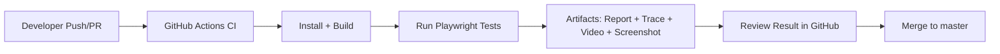

# คู่มือสร้างโปรเจกต์ Demo + Playwright + Pipeline (CI/CD) + Report/Trace + GitHub (ฉบับใช้งานจริง)

คู่มือนี้ออกแบบสำหรับสอนในคลาสและนำไปใช้จริงในงานทีมพัฒนา โดยอ้างอิงจากโปรเจกต์นี้โดยตรง

## เป้าหมายของคู่มือ

เมื่อจบคู่มือนี้ คุณจะทำได้ครบ:

1. สร้างเว็บ Demo ด้วย React + Vite + TypeScript
2. ติดตั้งและเขียน Playwright E2E test
3. ดูผลทดสอบผ่าน Report, Screenshot, Video, Trace
4. ตั้งค่า Pipeline บน GitHub Actions (CI)
5. ขยายเป็น CI/CD และใช้ในงานจริง
6. สอนนักเรียนหรือทีมงานให้ใช้งาน GitHub workflow ได้จริง

## ภาพรวมระบบ



---

## ส่วนที่ 1: สร้างโปรเจกต์ Demo จากศูนย์

### 1) สร้างโปรเจกต์ React + TypeScript

```bash
npm create vite@latest homework-automation-demo -- --template react-ts
cd homework-automation-demo
npm install
```

### 2) ตั้งเวอร์ชัน Node ให้ตรงทีม (แนะนำ)

โปรเจกต์นี้ใช้ Node 20 โดยมีไฟล์ `.nvmrc` และ script ช่วยสลับเวอร์ชันให้อัตโนมัติ

```bash
npm run setup
```

หมายเหตุ: ถ้าเครื่องยังไม่มี `nvm` ให้ติดตั้งก่อน หรือใช้ Node 20 ด้วยวิธีอื่น

### 3) รันเว็บ Demo

```bash
npm run dev
```

เปิดเว็บที่ `http://localhost:5173`

---

## ส่วนที่ 2: ติดตั้ง Playwright

### 1) ติดตั้งแพ็กเกจและ browser

```bash
npm install -D @playwright/test
npx playwright install --with-deps chromium
```

### 2) โครงสร้างไฟล์ที่ควรมี

```text
tests/
  e2e/
    homework-dashboard.spec.ts
playwright.config.ts
```

### 3) ค่าที่สำคัญใน playwright.config.ts ของโปรเจกต์นี้

- `testDir: './tests/e2e'`
- `retries: process.env.CI ? 1 : 0`
- `reporter: html + list + github`
- `trace: 'on-first-retry'`
- `screenshot: 'only-on-failure'`
- `video: 'retain-on-failure'`
- `webServer` สั่ง `npm run dev` เพื่อเปิดเว็บก่อนรันทดสอบ

---

## ส่วนที่ 3: การรันเทสต์และอ่านผล

### คำสั่งใช้งานหลัก

```bash
npm run test:e2e
npm run test:e2e:headed
npm run test:e2e:ui
```

### เปิดรายงาน HTML

```bash
npm run test:e2e:report
```

ไฟล์รายงานจะอยู่ในโฟลเดอร์ `playwright-report`

### ดู Trace เพื่อ debug

เมื่อเทสต์ fail และมี retry จะได้ trace ไว้ใน `test-results`

```bash
npx playwright show-trace path/to/trace.zip
```

สิ่งที่ควรดูใน Trace:

1. Network/Console errors
2. ลำดับ action ที่ fail จริง
3. Timing และ wait condition ที่ไม่พอ
4. locator ที่ไม่เสถียร

---

## ส่วนที่ 4: Pipeline (CI) บน GitHub Actions

โปรเจกต์นี้มี workflow อยู่แล้วที่ `.github/workflows/ci.yml`

### ลำดับการทำงานใน CI

1. Checkout source
2. Setup Node 20 + npm cache
3. `npm ci`
4. ติดตั้ง Playwright browser
5. Build web app
6. Run Playwright tests
7. Upload artifacts (`playwright-report`, `test-results`)

### เงื่อนไข trigger

- push ที่ `master`
- pull request เข้า `master`
- manual run (`workflow_dispatch`)

### ทำไมต้องอัปโหลด artifact เสมอ (`if: always()`)

เพราะแม้เทสต์ล้ม เราต้องมีหลักฐาน debug เช่น screenshot/video/trace/report เพื่อแก้ปัญหาได้เร็ว

---

## ส่วนที่ 5: CI/CD (จากพื้นฐานสู่ใช้งานจริง)

สถานะปัจจุบันของ repo นี้:

- มี CI เรียบร้อย
- พร้อมต่อยอดเป็น CD

ตัวอย่างแนวทาง CD ที่นิยม:

1. Deploy Preview ทุก Pull Request (เช่น Vercel/Netlify)
2. Deploy Production เมื่อ merge เข้า `master`
3. ตั้ง branch protection ให้ต้องผ่าน CI ก่อน merge

แนวปฏิบัติแนะนำ:

1. ใช้ environment secrets แยก `staging` และ `production`
2. ใส่ health-check หลัง deploy
3. มี rollback strategy (เช่น deploy เวอร์ชันก่อนหน้า)

---

## ส่วนที่ 6: วิธีเอาขึ้น GitHub แบบสอนทีมได้

### 1) สร้าง repository บน GitHub

ชื่อแนะนำ: `homework-automation-demo`

### 2) push โปรเจกต์ขึ้น GitHub

```bash
git init
git add .
git commit -m "feat: initial project setup"
git branch -M master
git remote add origin <YOUR_GITHUB_REPOSITORY_URL>
git push -u origin master
```

### 3) ทำงานแบบ branch + PR

```bash
git checkout -b feature/add-new-test
```

```bash
git add .
git commit -m "test: add overdue homework scenario"
git push -u origin feature/add-new-test
```

จากนั้นเปิด Pull Request และรอ CI ผ่านก่อน merge

### 4) Checklist ตอนรีวิว PR

1. Build ผ่าน
2. Playwright tests ผ่าน
3. ไม่มี flaky test ใหม่
4. มี artifact ให้ตรวจย้อนหลังเมื่อ fail
5. มีคำอธิบายผลกระทบของการเปลี่ยนแปลง

---

## ส่วนที่ 7: เอาไปใช้จริงในงาน

### รูปแบบการใช้ Playwright ที่แนะนำ

1. แยกชุดเทสต์ Smoke (เร็ว) และ Regression (ครบ)
2. รัน Smoke ทุก PR
3. รัน Regression ตาม schedule หรือก่อน release
4. ใช้ `data-testid` ให้ locator เสถียร
5. รันบน CI environment ที่ควบคุมได้

### ตัวอย่าง policy ในทีม

1. PR ไหน CI ไม่ผ่าน ห้าม merge
2. ถ้า fail ต้องแนบ link artifact ใน PR comment
3. เคสที่เคยหลุด bug ต้องเพิ่มเทสต์ป้องกัน regression

### Metrics ที่ควรติดตาม

1. Pass rate ต่อสัปดาห์
2. เวลาเฉลี่ยในการแก้ test fail
3. จำนวน flaky tests
4. จำนวน bug production ที่ควรถูกจับได้โดย E2E

---

## ส่วนที่ 8: แผนสอน 90 นาที (พร้อมใช้ในคลาส)

1. นาที 0-15: อธิบายระบบและ business rule
2. นาที 15-30: รันเว็บและทดลอง manual test
3. นาที 30-50: สอนโครงสร้าง Playwright และเขียนเทสต์ 1 เคส
4. นาที 50-65: ทำเทสต์ให้ fail แล้วเปิด Report/Trace สาธิตการ debug
5. นาที 65-80: เปิด GitHub Actions และอ่าน artifact จริง
6. นาที 80-90: ให้ผู้เรียนสร้าง branch, push, เปิด PR ด้วยตัวเอง

---

## ส่วนที่ 9: ปัญหาที่พบบ่อยและวิธีแก้

1. CI fail เพราะ browser ไม่ครบ:
   - ใช้ `npx playwright install --with-deps chromium` ใน pipeline
2. เทสต์ fail เพราะ timing:
   - ใช้ locator/assertion ที่รอได้เอง เช่น `expect(locator).toHaveText(...)`
3. เปิด report ไม่ได้:
   - เช็กว่ามีโฟลเดอร์ `playwright-report` แล้วค่อยรัน `npm run test:e2e:report`
4. Trace ไม่มี:
   - ใน config ต้องมี `trace: 'on-first-retry'` และต้องเกิด retry

---

## สรุปสั้น

โปรเจกต์นี้พร้อมใช้เป็นตัวอย่างงานจริงทั้งด้าน Web Demo, Automation Testing, GitHub Workflow, CI Pipeline และการสอนการทำงานแบบทีม หากต้องการขยายต่อ ให้เพิ่ม CD deploy และ quality gates ให้เข้มขึ้นตามระดับ production
